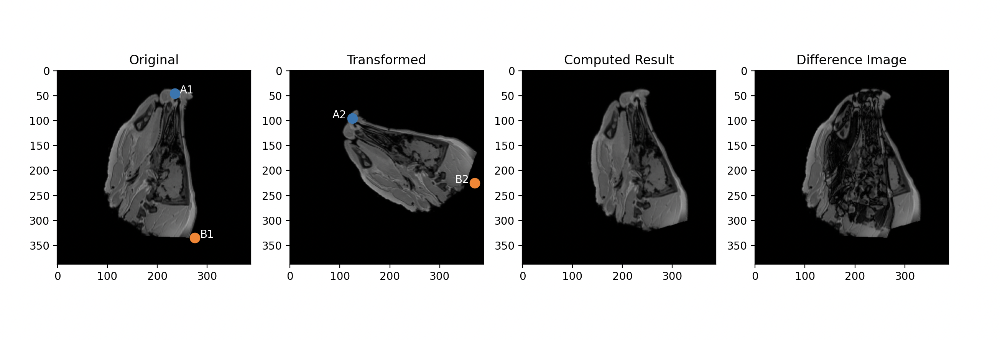

# assignment2_ipav
## Project Structure

## Project Structure

The project consists of the following modules:

```text
assignment2_ipav
│
├── data
│   ├── T1.jpg
│   └── T1_transformed.jpg
│
├── src
│   ├── transformation_parameters.py
│   ├── matrix.py
│   └── main.py
│
├── tests
│   └── transformation_methods_tests.py
│
└── README.md
```

### transformation_parameters.py
The module contains:

- compute_rotation_angle()
- compute_scaling()
- compute_offset()

### matrix.py

This module builds the affine transformation matrix from the computed parameters.

### main.py

This is the main application script.

- loads both images
- defines the points
- computes transformation parameters
- builds the affine matrix
- computes the inverse matrix
- compute the result image
- computes the difference image
- visualizes all required outputs

### transformation_methods_tests.py
The tests were used to verify the correctness of the implemented methods.

---

# Implementation

## Step 1 - Landmark Selection

I manually selected two anatomical landmarks in both images:

- A1 and B1 in the original image
- A2 and B2 in the transformed image

## Step 2 - Rotation Angle

The rotation angle was computed from the vectors:

```text
v1 = B1 - A1
v2 = B2 - A2
```
I found the functions `arctan()` and `arctan2()` in the NumPy documentation.
After reading about both functions, I decided to use `np.arctan2()` because it correctly handles all vector directions.
The angle of both vectors was calculated as:

```python
angle_v1 = np.arctan2(v1[1], v1[0])
angle_v2 = np.arctan2(v2[1], v2[0])
```
The final rotation angle was obtained from the difference between both angles.
I implemented the function `compute_rotation_angle()` and created several tests to verify the results.

## Step 3 - Scaling Factor
The scaling factor was computed from the ratio of the vector lengths.
I found two possible approaches:

- `np.sqrt()`
- `np.linalg.norm()`

After reading the documentation, I decided to use `np.linalg.norm()` because it directly computes the Euclidean vector length.
The scaling factor was calculated as:

```text
scale = |v2| / |v1|
```

While testing, I discovered that I originally used the inverse ratio.
The tests helped me find the mistake and I corrected the formula.
I implemented the function `compute_scaling()` and added several tests.

## Step 4 - Offset Computation

The offset was computed using the midpoint method described in the assignment.
First:

```text
HP1 = (A1 + B1) / 2
```

Then A2 and B2 were transformed using inverse scaling and inverse rotation to obtain A3 and B3.
Next:

```text
HP2 = (A3 + B3) / 2
```

Finally:

```text
offset = HP2 - HP1
```

I implemented this procedure in the function `compute_offset()`.

## Step 5 - Refactoring

After the functions were working correctly, I moved them into a separate module called:

```text
transformation_parameters.py
```

This made the main script shorter and easier to read.

## Step 6 - Affine Transformation Matrix

I created a separate module called:

```text
matrix.py
```

The affine transformation matrix combines:

1. translation to image center
2. scaling
3. rotation
4. translation back to image center
5. translation offset

The final matrix was constructed as:

```python
M = T2 @ R @ S @ T1 @ Toffset
```

## Step 7 - Registration

The inverse matrix was computed using:

```python
M_inv = np.linalg.inv(M)
```

The transformed image was registered back to the original image using:

```python
cv2.warpAffine()
```

as suggested in the assignment.

## Step 8 - Verification

To verify the implementation, I checked:

```text
M(A1) = A2
M(B1) = B2

M_inv(A2) = A1
M_inv(B2) = B1
```

The debug output confirmed that the selected landmarks were transformed correctly.

## Step 9 - Difference Image

The assignment required a difference image between the original image and the registered image.

I computed it as:

```python
img_difference = np.abs(
    original_image.astype(np.float32)
    - img_result.astype(np.float32)
)
```

The images were converted to `float32` before subtraction to avoid problems with `uint8` overflow and underflow.

## Step 10 - Visualization

The final visualization contains:

1. Original image with landmarks A1 and B1.
2. Transformed image with landmarks A2 and B2.
3. Registered image.
4. Difference image.

The landmark positions are displayed as overlays according to the assignment requirements.

---

# What I tried and how I solved it 

During testing I noticed that the registered image was still slightly shifted compared to the original image.

To understand the problem, I checked by logs:

- rotation angle
- scaling factor
- offset vector
- affine matrix
- landmark mappings

The matrix transformed the selected landmarks correctly.
Later I added visualization of the selected landmarks directly on the original and transformed images.
This helped me discover that the selected point B2 was not placed exactly on the same anatomical feature as B1.
The incorrect B2 position was caused by a manual measurement error during landmark selection.
Because the affine transformation parameters are computed only from two landmarks, even a small error in one point can affect the final registration result.


After correcting the B2 position, the computed rotation angle, scaling factor and offset changed, and the registration result improved noticeably.

## AI Assisted Debugging

During the implementation I used an AI assistant mainly as a learning tool.

The discussions focused on:

- difference between `np.arctan()` and `np.arctan2()` for rotation angle computation
- difference between `np.sqrt()` and `np.linalg.norm()` for vector length computation
- possible reasons why the registered image was still shifted even when the affine matrix transformed the selected landmarks correctly

You can find attached conversation in 3 files :
results/Computing vector scaling factor with NumPy - Claude.pdf
results/Arctan vs arctan2 for vector rotation angle - Claude.pdf
results/Affine transformation registration misalignment - Claude.pdf

# Final Parameters

```text
Rotation angle: -67.22 degrees
Scaling factor: 0.90
Offset vector: [30.60605321 35.90505248]
```

Final logs:
/Users/klimek/.local/bin/uv run /Users/klimek/repos/fhwn/IPAV/assignment2_ipav/.venv/bin/python /Users/klimek/repos/fhwn/IPAV/assignment2_ipav/src/main.py 
HP1 = [255. 190.]
HP2 = [285.60605321 225.90505248]
offset = [30.60605321 35.90505248]
HP2 - HP1 = [30.60605321 35.90505248]
A3 = [265.60605321  80.90505248]
B3 = [305.60605321 370.90505248]
Rotation angle: -67.22 degrees
Scaling factor: 0.90
Offset vector: [30.60605321 35.90505248]
[[  0.34912485   0.83115519   5.55367561]
 [ -0.83115519   0.34912485 274.61085181]
 [  0.           0.           1.        ]]
M(A1) = [125.  95.   1.], A2 = [125, 95]
M(B1) = [380. 163.   1.], B2 = [380, 163]
M_inv(A2) = [235.  45.   1.], A1 = [235, 45]
M_inv(B2) = [275. 335.   1.], B1 = [275, 335]
M(HP1) = [252.5 129.    1. ]
HP transformed = [252.5 129. ]


##  Result


